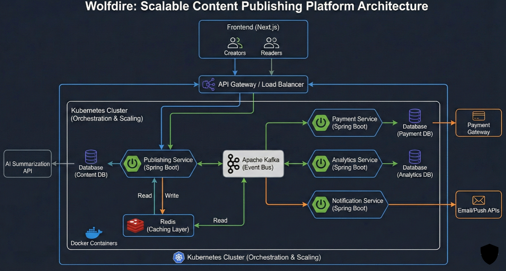

# Wolffire



**Wolffire** is a scalable content publishing platform designed to empower creators to write, distribute, and monetize long-form content while enhancing reader experience through AI-generated summaries. We enable creators to reach global audiences and build sustainable income streams from their work.

## Problem We Solve

Traditional publishing platforms face critical challenges:
- **Performance Bottlenecks**: Slow content delivery and inadequate scaling under high user activity
- **Limited Monetization**: Inflexible payment models that don't scale with creator needs
- **Poor Scalability**: Monolithic architectures that struggle with peak traffic
- **Fragmented Analytics**: Limited insights into reader behavior and content performance

Wolffire transforms publishing by combining cloud-native architecture, intelligent content summarization, and flexible monetization to create a truly scalable creator platform.

---

## Key Features

### For Creators

- **Content Management**: Intuitive publishing tools for long-form content creation
- **Monetization Options**: Subscription, pay-per-article, and membership models
- **Performance Analytics**: Real-time insights into reader engagement and revenue
- **Audience Building**: Tools to grow and nurture your reader base
- **Content Distribution**: One-click publishing to multiple channels

### For Readers

- **AI-Powered Summaries**: Instantly generated summaries for faster content consumption
- **Discovery Engine**: Personalized content recommendations based on preferences
- **Reading Experience**: Clean, distraction-free interface optimized for long-form reading
- **Subscription Access**: Flexible subscription tiers to access premium content
- **Offline Reading**: Download and read content without internet connectivity

### Enterprise Features

- **Scalable Infrastructure**: Handles millions of concurrent readers
- **Real-Time Analytics**: Immediate insights into content performance and revenue
- **AI Content Summarization**: Automatic generation of article summaries and highlights
- **Flexible Payment Processing**: Multi-currency support and regional payment methods
- **Push Notifications**: Engage readers with timely content updates
- **Event-Driven Architecture**: Real-time processing of subscriptions, payments, and user activity

---

## Architecture Overview

Wolffire is built on a cloud-native, microservices-based architecture designed for horizontal scaling and fault tolerance:

```
                          FRONTEND LAYER
                              |
                    Next.js Application
                   /              \
                  /                \
              Creators            Readers
                  |                  |
                  \_________________/
                          |
                          v
              API Gateway / Load Balancer
                          |
        ____________________________________________________
        |                                                  |
        v                                                  v
KUBERNETES CLUSTER                                EXTERNAL INTEGRATIONS
        |                                                  |
    MICROSERVICES:                                   Payment Gateway
    |                                                   |
    |---> Publishing Service (Spring Boot)        Email/Push APIs
    |     |
    |     |---> Content Database
    |     |
    |---> Payment Service (Spring Boot)           AI Summarization API
    |     |
    |     |---> Payment Database
    |
    |---> Analytics Service (Spring Boot)
    |     |
    |     |---> Analytics Database
    |
    |---> Notification Service (Spring Boot)
    |     |
    |     v
    |
    CENTRAL EVENT BUS
    |
    v
APACHE KAFKA
    |
    |---> Content Publication Events
    |---> Payment Events
    |---> Subscription Events
    |---> User Activity Tracking
    |---> Notification Triggers
    |
CACHING LAYER
    |
    v
REDIS (Caching)
    |---> Read/Write Operations
    |---> Frequently Accessed Content
    |---> Session Management
    |---> Real-Time Metrics
    |
CONTAINER ORCHESTRATION
    |
    v
Docker Containers (Orchestrated by Kubernetes)
    |---> Horizontal Scaling
    |---> Self-Healing
    |---> Load Balancing
    |---> Rolling Updates
```

### Core Components

**Frontend Layer:**
- **Next.js Application**: Modern, performant web application for creators and readers
- **Creators Dashboard**: Content management, analytics, and monetization tools
- **Readers Interface**: Clean reading experience with AI summaries

**API Layer:**
- **API Gateway**: Routes requests to appropriate microservices
- **Load Balancer**: Distributes traffic across instances

**Microservices (Kubernetes Orchestrated):**
- **Publishing Service**: Content creation, storage, and retrieval
- **Payment Service**: Subscription management and payment processing
- **Analytics Service**: Reader engagement and revenue tracking
- **Notification Service**: Email and push notification delivery

**Event-Driven Pipeline:**
- **Apache Kafka**: Asynchronous event processing for:
    - Content publication events
    - Payment and subscription workflows
    - User activity tracking
    - Notification triggers
    - Reliable service decoupling

**Data Layer:**
- **Content Database**: Article storage and metadata
- **Payment Database**: Transaction and subscription records
- **Analytics Database**: Reader behavior and engagement metrics

**Performance & Scalability:**
- **Redis Cache**: High-speed access to frequently read content and session data
- **Docker Containers**: Containerized services for consistent deployments
- **Kubernetes Orchestration**: Automatic scaling, health checks, and self-healing

**External Integrations:**
- **AI Summarization API**: Intelligent content summarization
- **Payment Gateway**: Secure payment processing
- **Email/Push APIs**: Multi-channel notifications

---

## Technology Stack

**Frontend & Web:**
- Next.js - Modern React-based web framework with server-side rendering

**Backend Services:**
- Spring Boot - Robust Java microservices framework

**Event Streaming & Processing:**
- Apache Kafka - Distributed event streaming platform

**Containerization & Orchestration:**
- Docker - Container packaging and standardization
- Kubernetes - Container orchestration, scaling, and management

**Data & Caching:**
- PostgreSQL/MySQL - Relational databases for content, payments, and analytics
- Redis - In-memory caching for high-throughput read operations

**Architecture Pattern:**
- Microservices - Independent, scalable services
- Event-Driven - Asynchronous, reliable data pipelines

**Advanced Features:**
- AI Summarization - Machine learning-powered content summarization
- Payment Gateway Integration - Multi-currency, multi-region transactions

---

## Getting Started

### For Creators

1. **Create Account**: Sign up with your email and basic information
2. **Setup Profile**: Configure your creator profile and brand
3. **Publish Content**: Write and publish your first article
4. **Configure Monetization**: Choose subscription model and pricing
5. **Grow Audience**: Use analytics to understand your readers
6. **Earn Revenue**: Receive payments through our secure payment system

### For Readers

1. **Browse Content**: Discover articles from your favorite creators
2. **Read Summaries**: Get quick insights with AI-generated summaries
3. **Subscribe**: Choose a subscription tier for unlimited access
4. **Personalize**: Customize your reading preferences and interests
5. **Get Notified**: Receive alerts for new content from followed creators

### User Dashboard Access

**Creator Dashboard**
- Content library and publishing tools
- Real-time analytics and performance metrics
- Revenue tracking and payment history
- Audience insights and engagement data
- Subscription management

**Reader Dashboard**
- Reading list and bookmarks
- Subscription management
- Reading history and preferences
- Personalized recommendations
- Notification settings

**Admin Dashboard**
- Platform analytics and health metrics
- User and creator management
- Payment settlement and reporting
- Content moderation tools
- System configuration

---

## Why Choose Wolffire?

- **Creator-First Design**: Built specifically for modern content creators
- **Scalable Architecture**: Handles millions of readers without performance degradation
- **Intelligent Content**: AI-powered summaries enhance reader engagement
- **Flexible Monetization**: Multiple revenue streams for creators
- **Real-Time Analytics**: Immediate insights into content performance
- **Global Payments**: Multi-currency support and local payment methods
- **Event-Driven Reliability**: Asynchronous processing ensures no data loss
- **Developer-Friendly APIs**: Easy integration with external tools

---

## Security & Compliance

- **Content Protection**: Encrypted storage and transmission of user data
- **Payment Security**: PCI-DSS compliant payment processing
- **Authentication**: Secure user authentication and authorization
- **Data Privacy**: GDPR and privacy regulation compliance
- **Audit Logging**: Complete event trails through Kafka
- **Rate Limiting**: Protection against abuse and DDoS attacks

---

## Performance Metrics

- **Content Delivery**: Sub-100ms response times via Redis caching
- **Scalability**: Handles 1M+ concurrent readers
- **Uptime**: 99.99% SLA with Kubernetes self-healing
- **Payment Processing**: Real-time transaction confirmation
- **Analytics**: <1 second dashboard refresh with event streaming

---

## Support & Documentation

For questions, feature requests, or technical support:

Documentation: https://docs.wolffire.io
Support: support@wolffire.io
Status Page: status.wolffire.io

---

## License

Proprietary - All rights reserved

---

Ready to start your content publishing journey?
Get Started with Wolffire: https://wolffire.io/signup

---

Wolffire - Where Content Creators Scale
